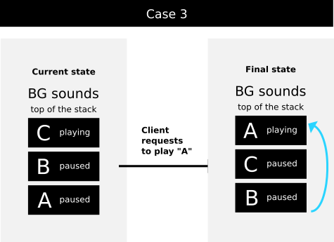

# Hacking on HackSoundServer

## Design
### Sound
A *Sound* object represents a sound and it follows the properties specified by its sound event id.
#### Sound pipeline
Each sound instance is represented by the following GStreamer pipeline:

    filesrc ! decodebin ! identity ! audioconvert ! pitch ! volume ! autoaudiosink

### Registry
Contains information about the current sounds, reference count of each sound, sounds classified by bus name watcher, sound events classified by sound event id and bus name and the list of background sounds.

#### Refcounting
The registry has a dictionary where it maps the refcount per each running sound. Typically, overlapping sounds  will always have a refcount of at most 1. However, non-overlapping sounds (`"overlap-behavior": "reset"` or `"overlap-behavior": "ignore"`) can have refcounts higher than 1. 
On non-overlapping sounds, each call to `PlaySound` will increase the refcount by one. This explains why you may realize in certain cases that calling the `StopSound` method does not stop the sound. *In fact, `StopSound` actually does not stop the sound, but just decreases its refcount.* 

#### Sounds classified by bus name watcher
Whenever a request to play a sound comes in, the server, watches the bus name of the peer. This was a feature added to ensure sounds are stopped if the application that played these sounds crashed, got killed or was closed. The registry stores this information in a dictionary having the following type structure:

    {
       "bus-name1": ("watcher-id-for-bus-name1", [uuid-a1, uuid2, ..., uuidn]),
       ...
    }
Having a dictionary like this allows *O(1)* access to the sounds of a given application when it dies.

#### Sounds classified by sound event id
Sounds are classified by its sound event id and bus name to filter sounds by a given sound event id and bus name saving iterations of a linear look up.

#### Background sounds
This is concept introduced to avoid having different background music sounds playing and overlapping between them at the same time. Sound instances of sound event ids with a metadata property `"type": "bg"` follow the rule that whenever a `PlaySound` call arrives on this type of sounds, the last *bg* sound is played back while the already playing *bg* sound (if any) is paused. If the playing sound finishes, then the last sound is resumed back to the playing state. This can be illustrated in the following figures:

In the *case 1*, the client requests to play a new sound. The server creates a new sound and plays it back. But there were already BG sounds on the stack, so the new sound is put on the top and set to the *PLAYING* state and the last sound on the top is paused.

In the *case 2*, a sound on the top of the BG sounds list/stack finishes (naturally because of reaching EOS or because the client called `StopSound`). In this case, this sound is removed from the BG sounds list and the new sound on the top is set to the *PLAYING* state.

In the *case 3*, a sound that already existed in the BG sounds list and that has an `"overlap-behavior": "ignore"` is requested to play. Because of an "ignoring" sound, no new instance can be created, but just its refcount is increased, then this sound is moved to the top, pausing the previous sound that was already on the top.

### Server
Some details to consider regarding the server are put on detail:
#### Autoquit
The server auto-quits 10 seconds after the last sound has been released. If in these 10 seconds lapse, a new sound is requested to be played back, then the timer is reset.

#### Limit of playing instances
There is a limit of at most 5 playing instances per sound event id.
*Note: this feature has been added as workaround in which the server got slow because it seems that the main con
text thread was being spammed by the GstMessage objects received on each GstBus of each sound.*

#### StopSound does not always stop a sound
 Initially, the `StopSound` method was added to stop a sound and it stopped the sound. However, when the refcounting feature was added, a call to `StopSound` does not stop a sound buy decreases its refcount. Each sound is refcounted and when its refcount reaches 0, then it "may be stopped".
In the case of sounds with no fade out, reaching a refcount of 0 implies to fully release a sound. However, in the case of sounds with fade out (greater than 0), reaching a refcount equal to 0 means to start fading out the sound, and the sound will be fully released when that fade effect finishes. However, if while in an in-progress fade-out, a client calls `PlaySound` on this sound, then the stop will be canceled.

#### TerminateSound does not always stop a sound
Calling `TerminateSound` forces to reach a refcount of 0. However, similar to what was described in the paragraph above, reaching a refcount of 0 does not mean to release a sound, but to start an in-progress fade out effect.
